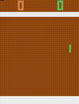

# ESE546_Final_Project

## Run commands
Go to the directory Atari_v1<br/>
Train the model by running ```python atari_main.py```

Afte training, the model and the video of the learned model are saved in the same folder
<p align="center">
    
</p>
